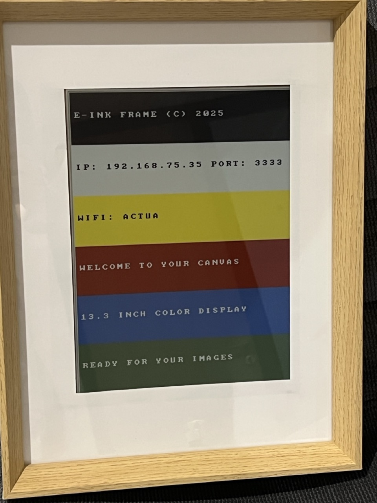
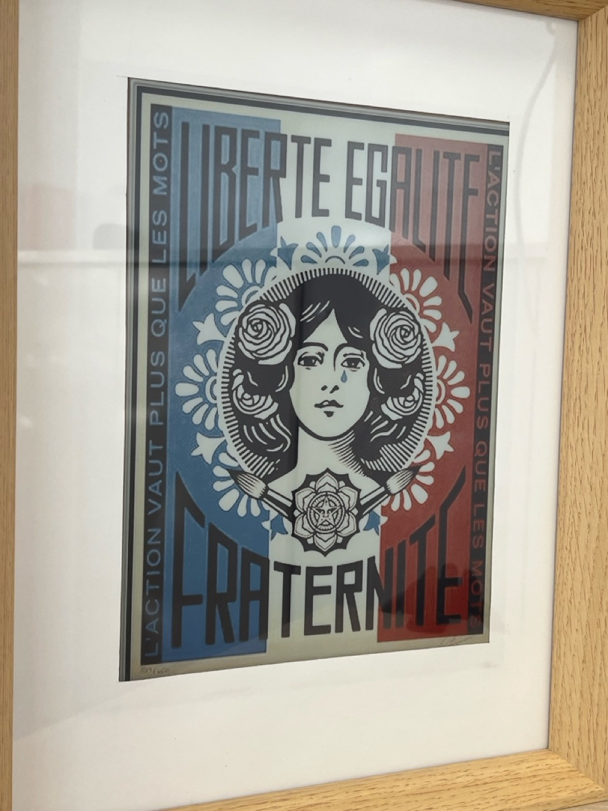

# ESP32 E-Ink Display Controller

Professional driver for Waveshare 13.3" 6-color e-Paper display with TCP streaming support. Optimized for Adafruit HUZZAH32 Feather with full battery operation capabilities.

## Gallery

### Boot Sequence


### Art Display


## Features

- **Display**: 13.3 inch, 1200x1600 resolution, 6-color support
- **Colors**: Black, White, Yellow, Red, Blue, Green
- **Architecture**: Dual-controller SPI (Master/Slave) for seamless full-width rendering
- **Connectivity**: WiFi-enabled TCP streaming on port 3333
- **Power Management**: Optimized for battery operation with smart power control
- **Boot Screen**: Professional splash with WiFi status, IP display, and battery monitoring
- **Battery Monitoring**: Real-time voltage and percentage display for LiPo batteries

## Hardware Compatibility

### Supported Boards
- **Adafruit HUZZAH32 Feather** (recommended for battery projects)
- **ESP32 DevKit** boards
- Any ESP32 with sufficient GPIO pins

### Display
- Waveshare 13.3inch e-Paper HAT (K) 6-color
- Compatible with HAT+ versions with onboard LDO regulators

## Pin Configuration

### HUZZAH32 Feather Wiring

| Feather Pin | Display Pin | Function | Notes |
|-------------|-------------|----------|-------|
| GPIO 5 (SCK) | SCK | SPI Clock | Hardware SPI |
| GPIO 18 (MOSI) | DIN | SPI Data | Hardware SPI |
| GPIO 33 (A9) | CS_M | Master Chip Select | |
| GPIO 15 (A8) | CS_S | Slave Chip Select | |
| GPIO 14 (A6) | DC | Data/Command | |
| GPIO 32 (A7) | RST | Reset | |
| GPIO 27 (A10) | BUSY | Busy Signal | |
| GPIO 21 | PWR | Power Control | Optional |
| BAT | VCC | Display Power | 3.7-4.2V direct |
| GND | GND | Ground | Common ground |

### Power Configuration

#### Battery Operation (Recommended)
- Connect Feather **BAT pin** directly to display **VCC**
- HAT's onboard LDO regulators handle voltage conversion
- Supports LiPo batteries (3.7V-4.2V)
- Automatic charge management via USB

#### USB Power
- Standard 5V USB power through Feather
- Power pass-through when charging

## Software Installation

### Using Arduino IDE

1. **Install ESP32 Board Support**
   - Add to Preferences → Additional Board URLs:
   ```
   https://raw.githubusercontent.com/espressif/arduino-esp32/gh-pages/package_esp32_index.json
   ```
   - Install "ESP32 by Espressif" in Board Manager

2. **Select Board**
   - For HUZZAH32: `Adafruit ESP32 Feather`
   - For DevKit: `ESP32 Dev Module`

3. **Clone Repository**
   ```bash
   git clone https://github.com/stephanebhiri/esp32-eink-display.git
   cd esp32-eink-display
   ```

4. **Configure WiFi**
   ```bash
   cp WiFiConfig.h.example WiFiConfig.h
   # Edit WiFiConfig.h with your credentials
   ```

5. **Upload**
   - Open `esp32-eink-display.ino`
   - Select correct port
   - Upload (115200 baud)

### Using PlatformIO

```ini
[env:featheresp32]
platform = espressif32
board = featheresp32
framework = arduino
monitor_speed = 115200
```

## TCP Streaming Protocol

### Connection
- **Port**: 3333
- **Protocol**: TCP
- **Format**: Custom packed 6-color binary

### Packet Structure

```
Header (7 bytes):
├── Magic: "E6" (2 bytes)
├── Width: 1200 (uint16_t LE)
├── Height: 1600 (uint16_t LE)
└── Format: 0x00 (1 byte)

Body (960,000 bytes):
├── Master data: 300 bytes × 1600 lines
└── Slave data: 300 bytes × 1600 lines
```

### Color Encoding (4-bit)
```
0x0: Black    0x3: Red
0x1: White    0x5: Blue
0x2: Yellow   0x6: Green
```

## Power Optimization

The firmware includes several power-saving features:

- **CPU Frequency**: Reduced to 160MHz (from 240MHz)
- **Display Power**: OFF between updates
- **Smart WiFi**: Connection timeout with offline mode
- **Efficient SPI**: 8MHz communication speed
- **WiFi Power Save**: MAX mode reduces consumption from 80mA to ~10mA during idle

### Battery Life

With a 10,000mAh battery:
- **Active**: ~400mA during refresh
- **Idle**: ~50mA with WiFi Power Save MAX
- **Expected Runtime**: 150+ hours continuous
- **TCP Latency**: 25-400ms (optimal for image transfers)

### Battery Monitoring

The HUZZAH32 Feather includes built-in battery monitoring capabilities:

- **Voltage Reading**: Pin A13 (GPIO35) with 2:1 voltage divider
- **Display**: Shows both voltage and percentage on boot screen
- **Range**: 3.0V (0%) to 4.2V (100%) for LiPo batteries
- **Accuracy**: ±0.1V typical, averaged over 5 readings
- **Auto-Detection**: Displays "USB POWER" when no battery connected

The battery status appears on the boot screen as:
```
BATTERY: 3.8V (67%)
```

## API Reference

### Core Functions

```cpp
// Initialize display hardware
void EPD_13IN3E_Init(void);

// Clear display to white
void EPD_13IN3E_Clear(void);

// Show boot splash with network info
void EPD_13IN3E_ShowBootSplash(const char* ssid, uint16_t port);

// Power management
void EPD_13IN3E_Sleep(void);
void EPD_13IN3E_PowerOn(void);
void EPD_13IN3E_PowerOff(void);
```

### TCP Streaming

```cpp
// Stream handling for real-time updates
void EPD_13IN3E_BeginFrameM(void);  // Start master frame
void EPD_13IN3E_WriteLineM(const uint8_t* data);
void EPD_13IN3E_EndFrameM(void);

void EPD_13IN3E_BeginFrameS(void);  // Start slave frame
void EPD_13IN3E_WriteLineS(const uint8_t* data);
void EPD_13IN3E_EndFrameS(void);

void EPD_13IN3E_RefreshNow(void);   // Trigger display update
```

## Troubleshooting

### Display Not Responding
- Check BUSY pin - should go LOW when ready
- Verify power supply can provide 150mA+ during refresh
- Ensure all SPI connections are secure

### WiFi Connection Issues
- Verify credentials in WiFiConfig.h
- Check 2.4GHz network (5GHz not supported)
- Monitor serial output at 115200 baud

### Power Issues on Feather
- Use BAT pin for display power (not 3V pin)
- Add 1000µF capacitor near display for stability
- Ensure battery is adequately charged

## Performance

- **Full Refresh**: ~2 seconds
- **Data Transfer**: ~1.5 seconds for complete frame
- **TCP Throughput**: 500KB/s typical
- **Color Depth**: 6 colors at native resolution

## Contributing

Contributions are welcome! Please submit pull requests with:
- Clear commit messages
- Updated documentation
- Test results on your hardware

## License

MIT License - See LICENSE file for details

## Author

Stephane Bhiri - 2025

## Acknowledgments

- Waveshare for display documentation
- Adafruit for HUZZAH32 Feather design
- ESP32 community for platform support